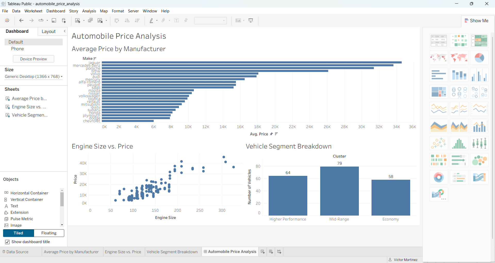

# Automobile Price Analysis

Phase 2 Capstone Project

## Project Overview

This project explores the factors related to automobile prices using exploratory data analysis, preprocessing, clustering, regression modeling, and Tableau.

## Dataset

The project uses the UCI Automobile dataset, which contains vehicle specifications such as engine size, horsepower, fuel efficiency, body style, manufacturer, and price.

## Project Process

The team completed:

- Exploratory Data Analysis
- Data cleaning and preprocessing
- K-Means clustering
- Regression modeling
- Model evaluation
- Tableau dashboarding

## Tableau Dashboard

[View the Tableau Dashboard](https://public.tableau.com/app/profile/victor.martinez7824/viz/AutomobilePriceAnalysis_17876941918850/AutomobilePriceAnalysis)

## Final Summary

The final project combines the team's analysis to identify important automobile pricing patterns, compare modeling approaches, and communicate the results through an interactive Tableau dashboard.